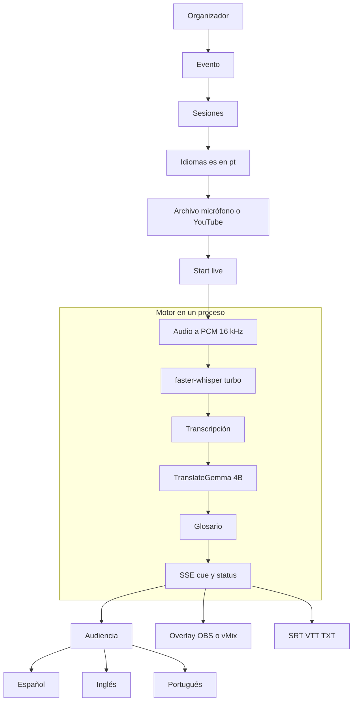
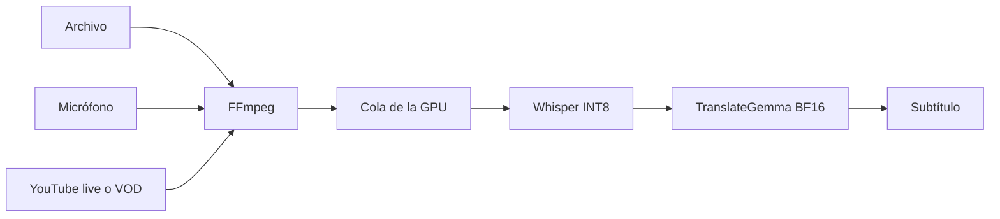

# EventLyra

Every voice. Every language. Everyone included.

EventLyra es una plataforma abierta de accesibilidad en vivo para conferencias. Toma el audio de una charla y lo convierte en subtítulos en tiempo real: transcripción del idioma original y traducción a español, inglés o portugués. Varias sesiones comparten una sola copia de los modelos en la GPU.

El nombre junta el evento con la lira de Hermes, símbolo de comunicación. La interfaz no depende de la mitología: muestra la señal que va de la voz a la audiencia.

El código de este repositorio está bajo MIT. Los pesos de TranslateGemma se bajan aparte y quedan bajo la licencia de Gemma.

## Camino rápido

En la PC con la RTX 4070 SUPER, después de aceptar la licencia Gemma:

```powershell
powershell -ExecutionPolicy Bypass -File .\scripts\setup-windows.ps1
cd apps\web
npm install
npm run build
cd ..\..
powershell -ExecutionPolicy Bypass -File .\scripts\run-windows.ps1 -SessionsPerGpu 2
```

Abrí http://127.0.0.1:8000

`K` (`-SessionsPerGpu`) es la cantidad de sesiones de **este** proceso. No tiene valor oculto: hay que pasarlo.

## Qué resuelve

En una conferencia como Nerdearla, la transcripción y la traducción en vivo dejan de escalar cuando hay muchas charlas en inglés al mismo tiempo. EventLyra corre en la máquina del evento, atiende varias salas con un solo par de modelos y deja que cada persona elija sesión e idioma.

No reemplaza a los intérpretes humanos. Es la pieza abierta para que la sala pueda seguir la charla en su idioma.

## Flujo del producto

El organizador confirma el evento, arma las sesiones que entran en `K`, elige idiomas y audio, y pone la sala en vivo. El motor transcribe, traduce y reparte el texto. La audiencia, el overlay y la exportación leen esa misma salida.



## Cómo viaja un fragmento de audio

Un archivo se corta en fragmentos de 8 segundos. Un live o un VOD de YouTube entra por yt-dlp y se corta cada 4 segundos, sin esperar a bajar el video entero. La GPU procesa **un fragmento a la vez** y reparte el turno entre las sesiones. No hay dos copias del modelo.

`latency_ms` es el tiempo de inferencia. `queue_wait_ms` es la espera en la cola. Son mediciones, no valores fijos.



En `/watch/:sessionId`, un live de YouTube con DVR se atrasa lo que mide el pipeline. Un VOD espera a `ready_until` para no adelantarse a los subtítulos. Sin DVR, la imagen queda en el vivo y el texto llega después, a la vista.

## Pantallas

La interfaz de producto es la SPA de `apps/web`. El encabezado lleva a Home, Events y For organizers, y abre el repositorio. FastAPI la sirve después de `npm run build`. Si `apps/web/dist` no existe, esas rutas caen al reproductor viejo.

| Quién | Ruta | Para qué |
| --- | --- | --- |
| Visitante | `/` | Presentar el producto y elegir audiencia u organizador |
| Audiencia | `/events` | Ver las charlas y entrar a una sala |
| Audiencia | `/watch/1` | Seguir la charla con subtítulos |
| Organizador | `/setup/event` | Confirmar el evento y el catálogo |
| Organizador | `/setup/sessions` | Configurar y arrancar cada canal |
| Producción | `/live` | Operar las salas que ya están en vivo |
| Emisión | `/overlay/1` | Quemar subtítulos en OBS o vMix |

`/watch` redirige a `/events`. `/setup/languages`, `/setup/audio` y `/setup/go` redirigen a `/setup/sessions`: idioma y audio viven en la card de cada canal.

Solo las primeras `K` charlas se atan a un canal de GPU. El resto queda en el catálogo y se ve en Events, pero no abre una sala.

El reproductor anterior sigue en `/legacy`. El desk anterior está en `/production`. El overlay anterior acepta `/overlay?sesion=1`.

### Home (`/`)

Presenta la frase de la marca y qué hace el producto: transcripción en vivo, traducción EN / ES / PT, código abierto y salida para web, OBS y vMix. Dos acciones salen de acá:

- **Explore live events** abre el catálogo de la audiencia.
- **Open organizer setup** abre la configuración del evento.

No muestra sesiones, latencia ni controles del motor.

### Events (`/events`)

Es el lobby de la audiencia. Lista las charlas del evento con imagen, título, sala, oradores, descripción y etiquetas. Se actualiza cada 4 segundos.

Los filtros son All, Live y Upcoming. Una charla en procesamiento aparece como **EN VIVO**. Si tiene canal de GPU, la card entra a `/watch/:id`. Si `K` ya está lleno, la card queda en el catálogo y no abre sala.

Esta pantalla no configura audio ni idiomas.

### Confirmar el evento (`/setup/event`)

Primer paso del organizador. Muestra el nombre de la edición, cuántos canales tiene esta GPU, las etiquetas del evento y la atribución de la agenda (caché público de Backstage, Nerdearla Argentina 2026).

Dos charlas de Nerdearla ya vienen cargadas, con imagen, descripción, etiquetas, oradores y URL de YouTube. **Add a talk** guarda otra en el catálogo: título, sala, track, descripción, etiquetas, oradores, imagen, URL de YouTube e idiomas de origen y destino. Si todavía hay canal libre, esa charla se ata al siguiente. Si no, queda solo en el catálogo.

**Continue to sessions** pasa al tablero.

El setup tiene tres pasos en la barra: Event, Sessions y Live desk.

### Configurar las salas (`/setup/sessions`)

Tablero de los canales `1..K` de este proceso. Cada card es una sala y concentra lo que antes estaba repartido en pantallas de idioma y de audio:

- Origen: detectar, español, inglés o portugués.
- Destino: español, inglés o portugués.
- Audio: archivo local, micrófono de esta pestaña, o URL pública de YouTube (live o charla ya subida). YouTube no es RTMP: EventLyra tira del audio.
- **Start live** y **Stop live**. Stop corta el micrófono de esa card y reinicia la sesión.
- Atajos a la vista de audiencia (`/watch/:id`) y al overlay (`/overlay/:id`).
- Exportación SRT, VTT o TXT cuando ya hay subtítulos. Si la card todavía no tiene cues, los botones no se pueden usar.
- Lecturas de la sala: tiempo de inferencia, gente con el stream de subtítulos abierto, espera en cola y cantidad de cues.

Arriba se ve si los modelos están cargados. Abajo, las charlas que quedaron solo en el catálogo porque no tienen canal en este proceso. Desde esta pantalla también se puede agregar otra charla.

El micrófono es de la pestaña que apretó Start. Otra sala con micrófono necesita otra pestaña.

### Desk en vivo (`/live`)

Es el mismo tablero, en modo operación. No vuelve a pedir el alta de charlas. Sirve para mirar las salas que ya están corriendo: estado **EN VIVO**, inferencia, audiencia conectada al stream, espera en cola, cues, error de la sesión si lo hay, Stop y exportación.

La confianza se muestra como no medida. No hay un número inventado.

Desde acá se vuelve al setup o se abre el catálogo de la audiencia.

### Sala de la audiencia (`/watch/:sessionId`)

La persona entra a una charla y se queda en esa sala. Arriba están el título, la sala y el estado: **EN VIVO** si el video es un live en procesamiento, **PROCESSING** si está procesando otra fuente, o el estado de espera.

El centro es el video o el audio, con el subtítulo encima. Los controles de esa persona, guardados en el navegador, son:

- Prender o apagar los subtítulos.
- Abrir la transcripción completa al costado y ver el cue activo.
- Elegir el texto: original, traducción, o los dos.
- Cambiar el tamaño (S, M, L, XL).
- Bajar o subir el volumen del reproductor.

Al lado queda la ficha de la charla: imagen, título, sala, track, oradores, descripción y etiquetas.

La audiencia no ve cola, modelos, latencia ni confianza.

### Overlay (`/overlay/:sessionId`)

Página transparente, sin menú ni controles. Muestra el último subtítulo: el original en blanco y la traducción en el color de la señal. OBS o vMix la cargan como fuente de navegador para quemar el texto en el stream. El detalle de medidas está en [integrations/obs/README.md](integrations/obs/README.md).

## Stack

| Capa | Tecnología |
| --- | --- |
| Transcripción | faster-whisper `turbo` (`mobiuslabsgmbh/faster-whisper-large-v3-turbo`), `compute_type=int8_float16` |
| Traducción | `google/translategemma-4b-it` en BF16, una copia en la GPU 0 |
| API y tiempo real | Python, FastAPI, Uvicorn, SSE (`cue` y `status`) |
| Audio | FFmpeg y yt-dlp |
| Interfaz | React, TypeScript, Vite, Tailwind CSS, React Router |
| Empaque sin GPU | Docker Compose |
| Pruebas | pytest, sin cargar pesos |

La traducción pasa por un borde reemplazable. El único proveedor de este corte es `local`. No hay cliente de Gemini, Vertex ni GCP. El 8-bit de bitsandbytes no se usa: degeneraba la salida. TranslateGemma 12B y 27B no se cargan.

## Máquina del demo con subtítulos

- Windows
- NVIDIA RTX 4070 SUPER (12 GB) con el driver al día
- Python 3.11 o 3.12
- Node.js para compilar `apps/web`
- Espacio en `E:\` para el entorno virtual, el trabajo y `HF_HOME`

El intérprete de Python puede vivir en el perfil del usuario. El venv y los pesos no: el script los deja en `E:\EventLyra\venv` y `E:\EventLyra\hf-home`.

## Credenciales

1. Creá una cuenta en [huggingface.co/join](https://huggingface.co/join).
2. Aceptá la licencia Gemma en [google/translategemma-4b-it](https://huggingface.co/google/translategemma-4b-it).
3. Creá un token de lectura en [huggingface.co/settings/tokens](https://huggingface.co/settings/tokens).

`scripts/setup-windows.ps1` pide el token en la misma consola (`hf auth login --token`). Lo guarda el CLI de Hugging Face, fuera del git. No lo copies a un `.env` versionado. Sin esa cuenta y sin la licencia aceptada, el 4B no se baja y no hay subtítulos reales.

## Instalación en Windows

En PowerShell, desde la raíz del repositorio:

```powershell
powershell -ExecutionPolicy Bypass -File .\scripts\setup-windows.ps1
```

El script:

1. Rechaza poner el venv, `HF_HOME` o el directorio de trabajo en `C:\`.
2. Crea `E:\EventLyra\venv`, `E:\EventLyra\hf-home` y `E:\EventLyra\work`.
3. Instala las dependencias y después torch desde `https://download.pytorch.org/whl/cu128`, para que no quede la rueda de CPU.
4. Instala ffmpeg con winget si falta.
5. Pide el token de Hugging Face y baja solo el 4B y el turbo.
6. Corta si `torch.cuda.is_available()` es falso.

Después compilá la interfaz. Sin este build, el servidor abre el reproductor viejo:

```powershell
cd apps\web
npm install
npm run build
```

## Cómo correr

```powershell
powershell -ExecutionPolicy Bypass -File .\scripts\run-windows.ps1 -SessionsPerGpu 2
```

En cada card de `/setup/sessions` elegí idiomas y audio: archivo, micrófono o URL pública de YouTube live/VOD. Start y Stop están en la misma card.

El camino de evaluación es transcripción en español o inglés, y traducción de inglés a español. Español a inglés y portugués usan el mismo modelo. El origen también acepta detección automática (`auto`).

`GET /api/health` tiene que mostrar un solo identificador de ASR y un solo identificador de traductor para todas las sesiones.

Formatos de entrada: wav, mp3, m4a, aac, ogg, flac, webm, mp4, mkv, mov.

Para armar un wav de prueba a partir de un video local:

```powershell
python scripts\preparar-muestra.py D:\charla.mp4 --nombre sesion-1
```

Queda `samples/sesion-1.wav` (mono, 16 kHz), ignorado por git. El detalle está en [samples/README.md](samples/README.md).

## OBS y vMix

No hay plugin nativo. En OBS: Fuentes, Navegador, `http://127.0.0.1:8000/overlay/1`. El fondo es transparente. La guía corta está en [integrations/obs/README.md](integrations/obs/README.md). vMix usa la misma URL de navegador.

La ingesta RTMP no está implementada. Start live no abre un servidor RTMP.

## Export y glosario

Desde la audiencia o desde producción se puede bajar la transcripción completa:

`GET /api/sessions/1/export?fmt=srt`

`fmt` acepta `srt`, `vtt` o `txt`.

Después de transcribir y traducir, un glosario fijo corrige nombres y términos (`Nerdearla`, `Gemma`, `CUDA`, `faster-whisper`, `EventLyra`) en [eventlyra/glossary/nerdearla.json](eventlyra/glossary/nerdearla.json).

## De 2 sesiones a más

- Misma GPU, mismo proceso: subí `K`. Siguen usando la misma copia de faster-whisper y la misma copia de TranslateGemma. Si la memoria se queda corta por las activaciones, bajá `K`.

```powershell
powershell -ExecutionPolicy Bypass -File .\scripts\run-windows.ps1 -SessionsPerGpu 4
```

- Más salas que las que esa GPU puede atender: levantá el mismo API en otra GPU o en otra máquina, cada una con su propio `K`.

Treinta salas no caben en esta 4070 SUPER.

## Sin GPU

Se puede abrir la interfaz, pero no hay subtítulos. El audio responde 503:

```powershell
python -m eventlyra --sessions-per-gpu 2 --sin-modelos
```

Docker Compose hace lo mismo: API más SPA, sin modelos.

```powershell
docker compose up --build
```

Kubernetes no forma parte de este corte.

## Desarrollo

```powershell
python -m pip install -r requirements-dev.txt
python -m pytest
```

Esas pruebas no cargan Whisper ni TranslateGemma.

## Qué queda fuera de este corte

- Ingesta RTMP.
- Plugin nativo de OBS.
- TranslateGemma 12B o 27B, Gemini, Vertex y GCP.
- Una copia de los pesos por pestaña o por ruta.
- Latencia o confianza inventadas. La confianza no se mide.

## Licencia

El código está bajo MIT. Ver [LICENSE](LICENSE).

Los pesos de TranslateGemma se rigen por https://ai.google.dev/gemma/terms y por la página del modelo en Hugging Face. faster-whisper turbo deriva de Whisper (MIT) en formato CTranslate2.
